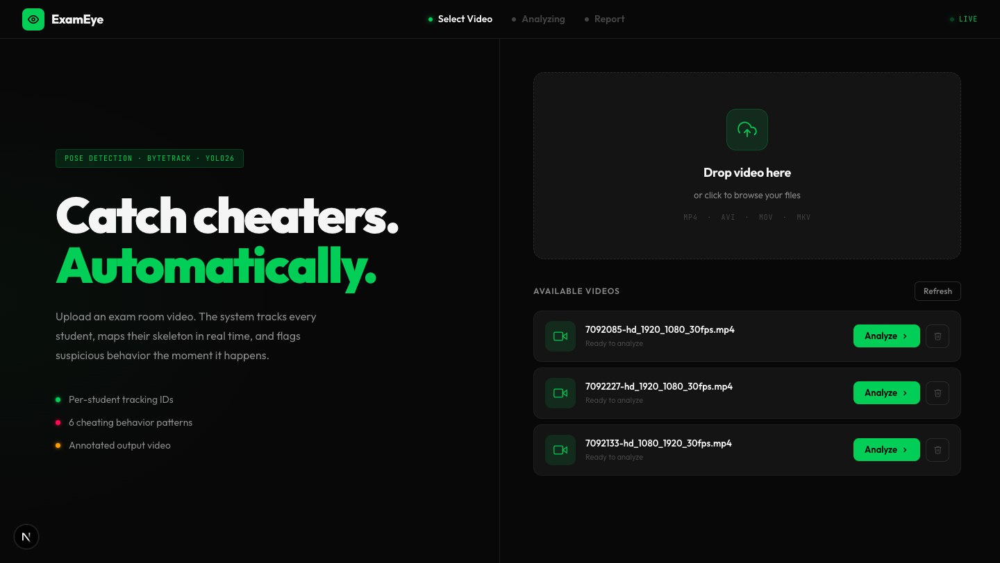
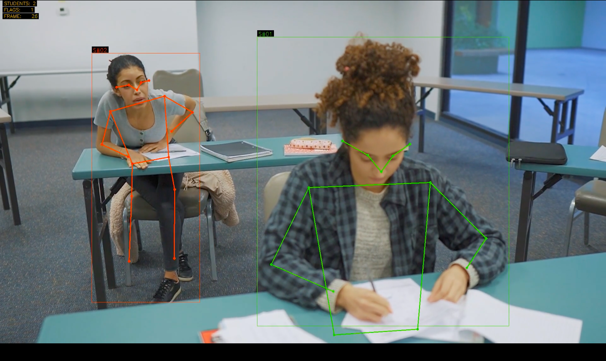

# 👁️ ExamEye — AI Exam Monitoring System

Upload an exam surveillance video and ExamEye detects every student, tracks them across frames, and flags suspicious behavior like head turns, body rotation, and sudden movement.

[](https://www.python.org/)
[](https://fastapi.tiangolo.com/)
[](https://github.com/ultralytics/ultralytics)
[](https://nextjs.org/)
[](https://opencv.org/)

---

## 🎯 Overview

ExamEye is a three-step pipeline: upload a video, run the analysis, get a full monitoring report. YOLO11n-pose detects every student and returns 17 body keypoints per person. ByteTrack gives each student a persistent ID across frames. The analyzer checks keypoints every frame using geometric and confidence-based rules and flags suspicious behavior. Live annotated frames stream to the browser during processing. Green skeleton means clean, red means flagged. A session report and downloadable annotated video are generated at the end.

---

## ✨ Features

- 🧍 **Pose Detection** — YOLO11n-pose, 17 COCO keypoints per person per frame
- 🔁 **Persistent Tracking** — ByteTrack keeps stable student IDs across the full video
- 🔴 **Live Color Coding** — Skeleton turns red on a flag, green when clean
- 📡 **Live Streaming** — Annotated frames stream to the browser over WebSocket
- 📋 **Per-Student Sidebar** — Live flag count and last action per student
- 🎬 **Annotated Output Video** — Full annotated MP4 saved and downloadable
- 📊 **Session Report** — Total students, total flags, most flagged student, and full event log
- 🗂️ **Video Management** — Upload, browse, and delete videos from the UI

---

## 🚨 What Gets Flagged

| Behavior | Detection Method |
|---|---|
| **Head Turn** | Ear confidence asymmetry + nose offset from ear midpoint + nose-to-eye distance ratio |
| **Body Turn** | One shoulder significantly higher than the other |
| **Looking Up** | Nose more than 30px above the ear level line |
| **Sudden Movement** | Shoulder midpoint rises more than 45px above the student's rolling baseline |

Each flag has a 2-second cooldown per student per action.

---

## 🔄 How It Works

| Step | What Happens |
|---|---|
| **1. Upload** | Upload a surveillance video or pick one already on the server |
| **2. Analyze** | YOLO11n-pose + ByteTrack process every frame, flags stream live |
| **3. Report** | Final stats, annotated output video, and full event log |

### Detection Pipeline

- YOLO11n-pose runs on every frame, returning bounding boxes and 17 keypoints per person
- ByteTrack assigns each person a persistent track ID for the full video
- `analyzer.py` checks keypoints every frame and returns a list of active flags
- `StudentTracker` converts per-frame flags into logged events with a 2-second cooldown
- Student count uses the mode over a 90-frame rolling window to ignore brief spurious detections
- Skeleton color is set per frame based on whether any flag is currently active

---

## 🖼️ Screenshots

<table align="center">
  <tr>
    <td align="center" width="100%">
      
      <br/><sub><b>ExamEye interface — upload, live monitoring, and session report screens</b></sub>
    </td>
  </tr>
</table>

**Pose Detection Output**
<table align="center">
  <tr>
    <td align="center" width="100%">
      
      <br/><sub><b>Left student flagged in red (suspicious behavior), right student clean in green</b></sub>
    </td>
  </tr>
</table>

---

## 🎬 Sample Output Videos

GitHub does not support video playback. Download the sample output videos from the links below.

- [Output.mp4](assets/Output.mp4)
- [Output2.mp4](assets/Output2.mp4)

---

## 🛠️ Tech Stack

### Detection & Tracking
- **YOLO11n-pose** — Pose estimation, 17 COCO keypoints per person per frame
- **ByteTrack** — Multi-object tracking with persistent IDs (via Ultralytics)
- **OpenCV** — Frame processing and annotation drawing

### Backend
- **FastAPI** — REST API and WebSocket server
- **imageio / libx264** — Output video encoding
- **Python 3.12+**

### Frontend
- **Next.js 15** — Three-screen UI (upload, processing, report)
- **Tailwind CSS** — Dark clinical theme
- **WebSocket** — Live frame and event streaming

---

## 🚀 Getting Started

### Prerequisites

- Python 3.12+
- Node.js 18+
- An exam surveillance video (MP4, AVI, MOV, or MKV)

### Backend Setup

1. **Clone the repository**
```bash
git clone https://github.com/adeel-iqbal/exam-eye-pose.git
cd exam-eye-pose
```

2. **Create a virtual environment**
```bash
python -m venv venv
source venv/bin/activate  # Windows: venv\Scripts\activate
```

3. **Install dependencies**
```bash
pip install --prefer-binary -r requirements.txt
```

> Use `--prefer-binary` to avoid building OpenCV from source. Tested on Python 3.12 with numpy 1.26.4.

4. **Model weights**

`yolo11n-pose.pt` downloads automatically on first run. No manual download needed.

5. **Run the backend**
```bash
uvicorn backend.main:app --host 0.0.0.0 --port 8002
```

The API is ready when you see `Pose model loaded` (takes 15-20 seconds on first startup).

### Frontend Setup

1. **Navigate to the frontend directory**
```bash
cd frontend
```

2. **Install dependencies**
```bash
npm install
```

3. **Start the dev server**
```bash
npm run dev
```

Open [http://localhost:3000](http://localhost:3000) in your browser.

---

## 💻 Usage

1. Upload an exam surveillance video or select one from the library
2. Click **Start Analysis**
3. Watch the live feed — green skeletons are clean, red are flagged
4. Monitor the sidebar for per-student flag counts and live alerts
5. Review the session report when processing finishes
6. Download the annotated output video
7. Click **New Session** to run again

---

## 📓 Development Notebook

`exameye_dev.ipynb` is a Colab-compatible notebook covering the full pipeline: load YOLO, inspect raw keypoints, visualize skeletons, test detection logic with printed intermediate values, process a full video, and download the output. Includes a threshold tuning playground.

---

## 📁 Project Structure

```
exam-eye-pose/
│
├── backend/
│   ├── main.py                # FastAPI app, WebSocket processing loop
│   ├── detector.py            # YOLO11n-pose inference, ByteTrack tracking
│   ├── analyzer.py            # Pose analysis rules and StudentTracker class
│   ├── drawer.py              # Skeleton and overlay drawing
│   └── bytetrack_exam.yaml    # ByteTrack configuration
│
├── frontend/
│   ├── app/
│   │   ├── page.tsx           # Upload, processing, and report screens
│   │   └── globals.css        # Dark clinical theme
│   └── package.json
│
├── models/
│   └── yolo11n-pose.pt        # Auto-downloaded on first run
│
├── videos/                    # Uploaded source videos
├── outputs/                   # Annotated output videos
├── assets/                    # Screenshots and sample output videos
├── exameye_dev.ipynb          # Development notebook
├── requirements.txt
└── README.md
```

---

## ⚠️ Disclaimer

Detection accuracy depends on video quality, camera angle, and lighting. The system only flags behavior it can measure geometrically. Do not use flags as definitive evidence of cheating without human review.

---

## 📧 Contact

**Adeel Iqbal**

- 📧 Email: [adeelmemon096@yahoo.com](mailto:adeelmemon096@yahoo.com)
- 💼 LinkedIn: [linkedin.com/in/adeeliqbalmemon](https://linkedin.com/in/adeeliqbalmemon)
- 🐙 GitHub: [@adeel-iqbal](https://github.com/adeel-iqbal)

---

<div align="center">
  <p>Made with ❤️ by Adeel Iqbal</p>
  <p>⭐ Star this repo if you find it useful!</p>
</div>
